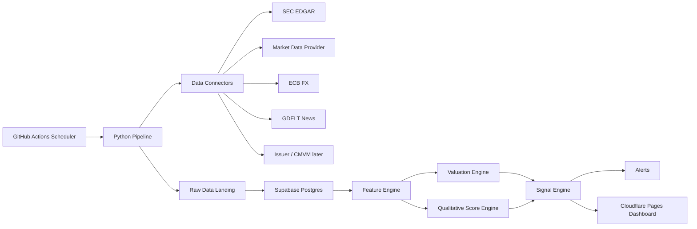

# 01 — Architecture

## High-level architecture



## Components

### 1. Python pipeline

The Python pipeline is responsible for all scheduled backend computation.

Responsibilities:

- read watchlist from Supabase or YAML fallback;
- call external providers;
- apply rate limits and retries;
- store raw payloads;
- normalise data;
- calculate ratios and features;
- run valuation models;
- run signal model;
- write daily snapshots;
- send alerts.

Recommended modules:

```text
src/
  config/
  connectors/
  db/
  etl/
  features/
  valuation/
  scoring/
  alerts/
  utils/
  cli.py
```

### 2. Supabase Postgres

Supabase is used as the operational database and can also serve read-only dashboard data through generated APIs.

Data categories:

- company master data;
- watchlist;
- prices;
- FX rates;
- filings;
- raw provider responses;
- normalised financial statements;
- ratios and features;
- qualitative scores;
- valuation runs;
- signal runs;
- alert rules and alert history;
- pipeline logs.

### 3. GitHub Actions

GitHub Actions runs scheduled jobs.

Recommended schedules:

- daily market-data and scoring pipeline after US market close;
- optional morning pipeline for EU companies;
- weekly quality and reconciliation job;
- monthly model backtest and recalibration job.

For MVP, implement only one daily workflow.

### 4. Cloudflare Pages

Cloudflare Pages hosts a static or SPA dashboard.

Recommended frontend:

- React + Vite + TypeScript;
- Supabase client for read-only data;
- Cloudflare Pages deployment from GitHub.

Initial dashboard views:

- watchlist table;
- company detail page;
- valuation summary;
- signal history;
- alerts and changes.

### 5. Alerts

Alert channels:

- SMTP email;
- Telegram bot messages.

Alert rules should be user-configurable in Supabase.

Example alert triggers:

- signal changes from hold to buy;
- conservative margin of safety above threshold;
- sell probability above threshold;
- new filing detected;
- negative red flag detected;
- material change in intrinsic value estimate.

## Data flow

### Raw-first ingestion

Every external response must be stored in `raw_provider_payloads` with:

- provider name;
- endpoint;
- request parameters;
- response JSON/text;
- checksum;
- fetched timestamp;
- linked company if applicable.

Only after raw storage should the pipeline normalise data into analytical tables.

### Point-in-time snapshots

The app must create daily snapshots so historical decisions can be reconstructed.

A signal produced on a given day must only use data that was known on that day. Avoid look-ahead bias.

## Provider strategy

### MVP default providers

Use this order:

1. SEC EDGAR for US filings and facts.
2. Financial Modeling Prep or Finnhub for prices and basic financials.
3. ECB for FX rates.
4. GDELT for news/event monitoring.

### Provider abstraction

All providers must implement a shared interface:

```python
class ProviderClient:
    provider_name: str

    def fetch(self, request: ProviderRequest) -> ProviderResponse:
        ...
```

Do not call external APIs directly from feature or valuation modules. Use connector classes only.

## Security architecture

Secrets are stored in GitHub Actions secrets and local `.env` files.

Required secrets:

- `SUPABASE_URL`
- `SUPABASE_SERVICE_ROLE_KEY`
- `SUPABASE_ANON_KEY`
- `FMP_API_KEY` or alternative provider key
- `FINNHUB_API_KEY` if used
- `ALPHA_VANTAGE_API_KEY` if used
- `SMTP_HOST`
- `SMTP_PORT`
- `SMTP_USER`
- `SMTP_PASSWORD`
- `ALERT_EMAIL_FROM`
- `ALERT_EMAIL_TO`
- `TELEGRAM_BOT_TOKEN`
- `TELEGRAM_CHAT_ID`

Never commit `.env` files.

## Architecture constraints

- Keep data processing in Python, not frontend.
- Keep frontend read-only for MVP.
- Keep manual qualitative overrides auditable.
- Do not expose provider keys in browser code.
- Avoid storing personal financial positions in MVP unless necessary.
